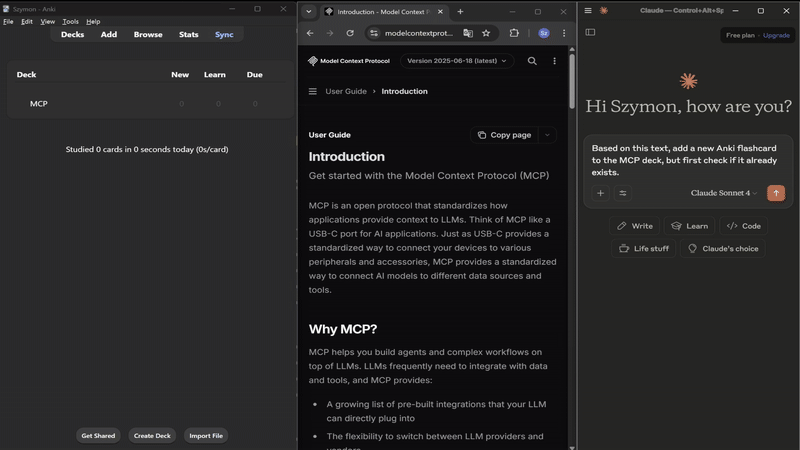

# Anki Connect MCP Server

A Model Context Protocol (MCP) server that provides seamless integration with Anki through the AnkiConnect add-on. This server enables AI assistants and other MCP clients to interact with your Anki flashcard collection programmatically.



## What is Anki Connect?

[AnkiConnect](https://ankiweb.net/shared/info/2055492159) is a powerful Anki add-on that exposes Anki's functionality through a REST API. It allows external applications to:

- Create, modify, and delete flashcards
- Manage decks and their configurations
- Control Anki's GUI programmatically
- Search and retrieve card information
- Manage tags and note types
- Perform bulk operations on cards and notes

## What is MCP (Model Context Protocol)?

The Model Context Protocol is a standardized way for AI assistants to connect to external data sources and tools. This MCP server acts as a bridge between MCP clients (like Claude Desktop) and AnkiConnect, allowing AI assistants to help you manage your Anki flashcards naturally through conversation.

## Features

This MCP server provides comprehensive access to AnkiConnect functionality through the following tools:

### Flashcard Management
- `create_flashcard()` - Create new flashcards with front and back content
- `add_note()` - Add notes with custom fields and tags
- `add_notes()` - Bulk add multiple notes
- `update_note_fields()` - Update existing note fields
- `find_notes()` - Search for notes using Anki's query syntax

### Deck Management
- `deck_names()` - Get all deck names
- `deck_names_and_ids()` - Get deck names with their IDs
- `change_deck()` - Move cards between decks
- `delete_decks()` - Delete decks and optionally their cards
- `get_deck_config()` - Retrieve deck configuration settings

### Card Operations
- `find_cards()` - Search for cards
- `cards_info()` - Get detailed card information
- `suspend()` / `unsuspend()` - Suspend/unsuspend cards
- `are_suspended()` / `are_due()` - Check card status

### GUI Control
- `gui_deck_browser()` - Open deck browser
- `gui_deck_review()` - Start deck review
- `gui_browse()` - Open card browser with search
- `gui_add_cards()` - Open add cards dialog

### Utility Tools
- `version()` - Get AnkiConnect version
- `get_tags()` - Retrieve all tags
- `multi()` - Execute multiple AnkiConnect requests in batch

## Prerequisites

### 1. Install AnkiConnect Add-on

1. Open Anki
2. Go to **Tools** → **Add-ons**
3. Click **Get Add-ons...**
4. Enter the code: `2055492159`
5. Click **OK** and restart Anki

### 2. Configure AnkiConnect (Optional)

AnkiConnect works out of the box, but you can customize its settings:

1. Go to **Tools** → **Add-ons**
2. Select **AnkiConnect** and click **Config**
3. Modify settings if needed (default port is 8765)
4. Restart Anki after making changes

## Installation

1. Clone this repository:
```bash
git clone https://github.com/spacholski1225/anki-connect-mcp.git
cd anki-connect-mcp
```

2. Install dependencies:
```bash
npm install
```

3. Build the project:
```bash
npm run build
```

## MCP Client Configuration

### Claude Desktop

To use this MCP server with Claude Desktop, add the following configuration to your MCP settings file:

**Location of MCP configuration file:**
- **Windows**: `%APPDATA%\Claude\claude_desktop_config.json`
- **macOS**: `~/Library/Application Support/Claude/claude_desktop_config.json`
- **Linux**: `~/.config/Claude/claude_desktop_config.json`

**Configuration Options:**

#### Option 1: Using Node.js (Local Installation)
```json
{
  "mcpServers": {
    "anki-connect-mcp": {
      "command": "node",
      "args": [
        "dist/index.js"
      ],
      "env": {},
      "disabled": false,
      "alwaysAllow": [
        "deck_names",
        "cards_info",
        "deck_names_and_ids",
        "gui_deck_browser"
      ]
    }
  }
}
```

#### Option 2: Using npx (NPM Package)

**Then configure your MCP client:**
```json
{
  "mcpServers": {
    "anki-connect": {
      "command": "npx",
      "args": [
        "@spacholski1225/anki-connect-mcp"
      ],
      "env": {},
      "disabled": false,
      "alwaysAllow": [
        "deck_names",
        "cards_info",
        "deck_names_and_ids",
        "gui_deck_browser"
      ]
    }
  }
}
```

#### Option 3: Using Docker
```json
{
  "mcpServers": {
    "anki-connect": {
      "command": "docker",
      "args": [
        "run",
        "--rm",
        "-i",
        "--network=host",
        "-e", "ANKI_CONNECT_URL=http://host.docker.internal:8765",
        "spacholski/anki-connect-mcp:latest"
      ],
      "env": {},
      "disabled": false,
      "alwaysAllow": [
        "deck_names",
        "cards_info",
        "deck_names_and_ids",
        "gui_deck_browser"
      ]
    }
  }
}
```

**Docker-Specific AnkiConnect Configuration:**

When using the Docker option, you **must** configure AnkiConnect with specific settings to allow Docker container access:

1. Go to **Tools** → **Add-ons** in Anki
2. Select **AnkiConnect** and click **Config**
3. Update the configuration with the following settings:

```json
{
    "apiKey": null,
    "apiLogPath": null,
    "ignoreOriginList": [],
    "webBindAddress": "0.0.0.0",
    "webBindPort": 8765,
    "webCorsOriginList": [
        "http://localhost",
        "http://host.docker.internal",
        "http://host.docker.internal:3000"
    ]
}
```

**Key Docker Configuration Points:**
- **`webBindAddress: "0.0.0.0"`** - Allows AnkiConnect to accept connections from any IP address (required for Docker containers)
- **`webCorsOriginList`** - Must include `"http://host.docker.internal"` and related origins to allow cross-origin requests from Docker containers
- Restart Anki after making these configuration changes

**Important Notes:**
- **For Node.js option**: Replace the path in `args` with the actual path to your built `index.js` file
- **For npx option**: Uses the published NPM package `@spacholski1225/anki-connect-mcp` - no local installation required
- **For Docker option**: Uses the pre-built Docker image `spacholski/anki-connect-mcp:latest`
- The `alwaysAllow` array contains tools that won't require confirmation each time
- Make sure Anki is running with AnkiConnect enabled before using the MCP server
- For Docker option, the `--network=host` flag allows the container to access AnkiConnect on the host machine

## Usage Examples

Once configured with an MCP client like Claude Desktop, you can interact with your Anki collection naturally:

- *"Create a flashcard about the capital of France"*
- *"Show me all my deck names"*
- *"Find all cards tagged with 'vocabulary'"*
- *"Suspend all cards in the 'Difficult Words' deck"*
- *"Open the deck browser in Anki"*

## Troubleshooting

### Common Issues

1. **Connection refused**: Make sure Anki is running and AnkiConnect is installed
2. **Port conflicts**: Check if port 8765 is available or configure AnkiConnect to use a different port
3. **Permission errors**: Ensure the MCP server has proper file system permissions
4. **Tool not found**: Verify the MCP client configuration and restart the client

## Contributing

Contributions are welcome! Please feel free to submit issues, feature requests, or pull requests.

## License

ISC License

## References

- [AnkiConnect Documentation](https://foosoft.net/projects/anki-connect/)
- [Model Context Protocol Specification](https://modelcontextprotocol.io/)
- [MCP SDK Documentation](https://github.com/modelcontextprotocol/typescript-sdk)
